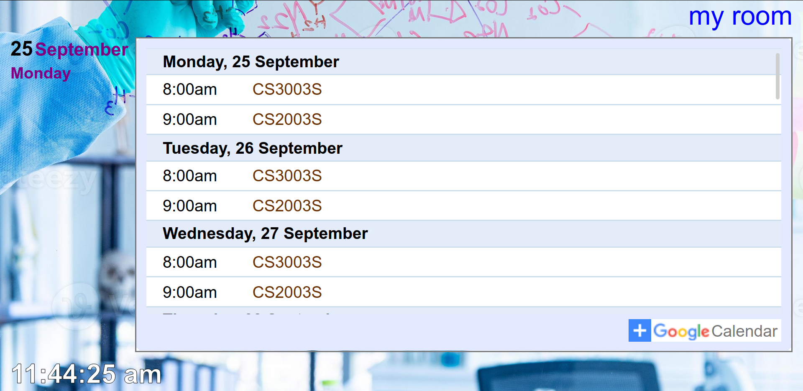

# CampuSign

CampuSign is a proof-of-concept digital signage software created as a student Capstone project at UCT.

The default username is `A@ADMIN` with password `PASSWORD`. The default admin password may be changed by setting the
`CAMPUSIGN_ADMIN_PASSWORD` when running the application for the first time.

## Installation

1. Install dprint: https://dprint.dev/install/
2. Install a recent Python 3
3. Install [Git bash](https://git-scm.com/downloads) if not on Linux/WSL
4. Install [Just](https://github.com/casey/just)
5. Install npm and Node.js (either use [`nvm` on Linux](https://github.com/nvm-sh/nvm) or follow a [Windows guide](https://radixweb.com/blog/installing-npm-and-nodejs-on-windows-and-mac))
6. Run `just setup`

To run, use the `just server` command.

## Development tips

- **Update dependencies:** `just setup`
- **Run tests:** `just test`
- **Format code:** `just format`
- **Lint code:** `just lint`
